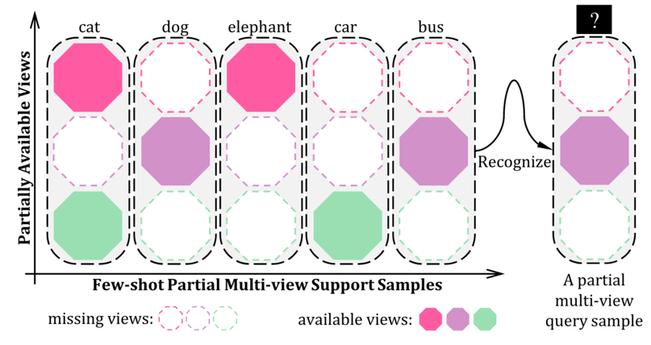
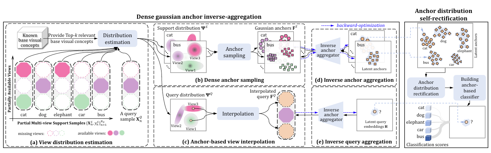

# 🍀 PyTorch Implementation of  Few-shot Partial Multi-view Learning 🍀

## ♨ An overview of the proposed few-shot partial multi-view learning task:
<p align="center">

</p>

## ♨ A schematic illustration for the unified Gaussian dense-anchoring approach: 
<p align="center">

</p>


## ♨ Preparation
(1) Please download the [data](https://drive.google.com/file/d/17orep2zqE7LrsqTsKI6l4AKMC3jiD_yc/view?usp=sharing) and put it into the root path of the project `./UGDA/`;    
(2) Please run the commend:  `pip install -r requirments.txt`;

## ♨ Script Running
please use the following commend to run the scripts:  
`bash runcmd/{data name}/run.sh`

The results will be around to the followings:   

| dataset           | 0 | 0.1   | 0.2   | 0.3   | 0.4   | 0.5  |
|-------------------|-----|-------|-------|-------|-------|-------|
| Cub-googlenet-doc2vec | 95.59 | 90.76 | 87.72 | 83.28 | 80.16 | 76.69 |
| Handwritten       | 89.08 | 85.44 | 80.51 | 76.13 | 71.27 | 66.77 |
| Caltech102        | 59.13 | 54.15 | 51.35 | 47.81 | 44.29 | 42.05 |
| Scene15           | 72.37 | 70.15 | 67.11 | 65.83 | 63.26 | 62.17 |
| Animal            | 89.86 | 84.34 | 77.96 | 72.59 | 66.71 | 62.25 |
| ORL               | 95.79 | 92.64 | 86.59 | 81.41 | 72.44 | 64.78 |

📌 To improve readability, we have comprehensively polished the code 
before releasing it, including comprehensive cleaning and re-organization, 
which may result in slight differences from the original one. Please be free to leave 
your questions in the issue panel. The paper is available at here: [https://ieeexplore.ieee.org/abstract/document/10123043/](https://ieeexplore.ieee.org/abstract/document/10123043/). If our work is helpful for your research, 
please consider to cite our  paper or give our project a start.    
```
@ARTICLE{10123043,
  author={Zhou, Yuan and Guo, Yanrong and Hao, Shijie and Hong, Richang and Luo, Jiebo},
  journal={IEEE Transactions on Pattern Analysis and Machine Intelligence}, 
  title={Few-Shot Partial Multi-View Learning}, 
  year={2023},
  volume={45},
  number={10},
  pages={11824-11841},
  doi={10.1109/TPAMI.2023.3275162}}
}
```


